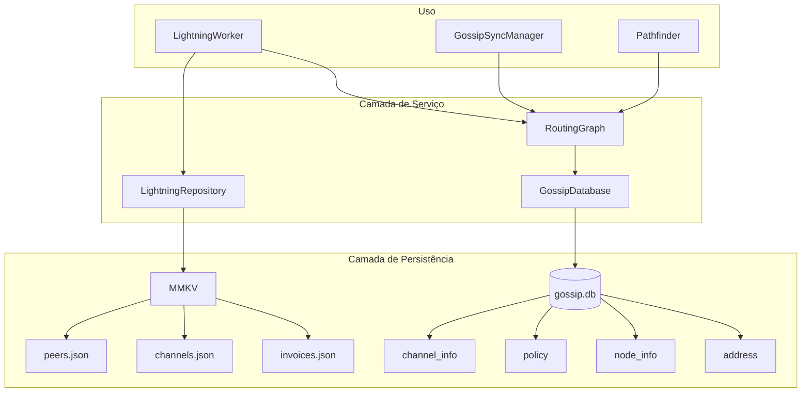

# Gossip Graph Database Implementation

**Data:** 21 de dezembro de 2025  
**Status:** Proposta de implementação  
**Objetivo:** Escalar o grafo de roteamento para 12k+ nós e 40k+ canais (paridade Electrum)

---

## 1. Problema Atual

### 1.1 Limitações do MMKV + JSON

O iHodl atualmente usa MMKV para persistir o grafo de roteamento como um único JSON:

```typescript
// src/core/repositories/lightning.ts
lightningStorage.set(STORAGE_KEYS.ROUTING_GRAPH, JSON.stringify(graph))
```

**Problemas:**
| Problema | Impacto |
|----------|---------|
| JSON.stringify de 40k canais | ~500ms bloqueante |
| JSON.parse na inicialização | ~800ms bloqueante |
| Memória O(n) para parse | Crash em devices com pouca RAM |
| Reescrita total em cada update | Desgaste de flash storage |
| Limite prático ~100MB | Não suporta rede completa |

### 1.2 Como o Electrum Resolve

O Electrum usa SQLite com tabelas otimizadas:

```python
# electrum/channel_db.py - Linhas 370-390
create_channel_info = """
CREATE TABLE IF NOT EXISTS channel_info (
  short_channel_id BLOB(8),
  msg BLOB,
  PRIMARY KEY(short_channel_id)
)"""

create_policy = """
CREATE TABLE IF NOT EXISTS policy (
  key BLOB(41),  -- short_channel_id (8) + node_id (33)
  msg BLOB,
  PRIMARY KEY(key)
)"""

create_node_info = """
CREATE TABLE IF NOT EXISTS node_info (
  node_id BLOB(33),
  msg BLOB,
  PRIMARY KEY(node_id)
)"""

create_address = """
CREATE TABLE IF NOT EXISTS address (
  node_id BLOB(33),
  host STRING(256),
  port INTEGER NOT NULL,
  timestamp INTEGER,
  PRIMARY KEY(node_id, host, port)
)"""
```

**Características:**

- `SqlDB` com commit batching (`commit_interval=100`)
- Queries indexadas por primary key
- Armazenamento de mensagens raw BOLT para verificação
- Prune automático de policies antigas (2 semanas)

---

## 2. Solução Proposta

### 2.1 Arquitetura



### 2.2 Classes Principais

#### GossipDatabase

```typescript
// src/core/lib/lightning/gossip-database.ts

import * as SQLite from 'expo-sqlite'

export interface ChannelInfo {
  shortChannelId: Uint8Array // 8 bytes
  node1Id: Uint8Array // 33 bytes
  node2Id: Uint8Array // 33 bytes
  capacitySat?: number
  rawMsg?: Uint8Array // Original BOLT message
}

export interface Policy {
  shortChannelId: Uint8Array
  startNodeId: Uint8Array
  cltvDelta: number
  htlcMinimumMsat: bigint
  htlcMaximumMsat?: bigint
  feeBaseMsat: number
  feeProportionalMillionths: number
  channelFlags: number
  messageFlags: number
  timestamp: number
  rawMsg?: Uint8Array
}

export interface NodeInfo {
  nodeId: Uint8Array // 33 bytes
  features: number
  timestamp: number
  alias: string
  rawMsg?: Uint8Array
}

export interface NodeAddress {
  nodeId: Uint8Array
  host: string
  port: number
  timestamp: number
}

export class GossipDatabase {
  private db: SQLite.SQLiteDatabase
  private pendingWrites: number = 0
  private readonly COMMIT_INTERVAL = 100

  // Stats
  numNodes: number = 0
  numChannels: number = 0
  numPolicies: number = 0

  private constructor(db: SQLite.SQLiteDatabase) {
    this.db = db
  }

  static async open(): Promise<GossipDatabase> {
    const db = await SQLite.openDatabaseAsync('gossip.db')
    const instance = new GossipDatabase(db)
    await instance.createTables()
    await instance.loadStats()
    return instance
  }

  private async createTables(): Promise<void> {
    await this.db.execAsync(`
      CREATE TABLE IF NOT EXISTS channel_info (
        short_channel_id BLOB PRIMARY KEY,
        node1_id BLOB NOT NULL,
        node2_id BLOB NOT NULL,
        capacity_sat INTEGER,
        msg BLOB
      );
      
      CREATE TABLE IF NOT EXISTS policy (
        key BLOB PRIMARY KEY,
        cltv_delta INTEGER NOT NULL,
        htlc_minimum_msat TEXT NOT NULL,
        htlc_maximum_msat TEXT,
        fee_base_msat INTEGER NOT NULL,
        fee_proportional_millionths INTEGER NOT NULL,
        channel_flags INTEGER NOT NULL,
        message_flags INTEGER NOT NULL,
        timestamp INTEGER NOT NULL,
        msg BLOB
      );
      
      CREATE TABLE IF NOT EXISTS node_info (
        node_id BLOB PRIMARY KEY,
        features INTEGER NOT NULL,
        timestamp INTEGER NOT NULL,
        alias TEXT,
        msg BLOB
      );
      
      CREATE TABLE IF NOT EXISTS address (
        node_id BLOB NOT NULL,
        host TEXT NOT NULL,
        port INTEGER NOT NULL,
        timestamp INTEGER NOT NULL,
        PRIMARY KEY (node_id, host, port)
      );
      
      CREATE INDEX IF NOT EXISTS idx_policy_timestamp ON policy(timestamp);
      CREATE INDEX IF NOT EXISTS idx_node_timestamp ON node_info(timestamp);
    `)
  }

  private async loadStats(): Promise<void> {
    const result = await this.db.getFirstAsync<{
      nodes: number
      channels: number
      policies: number
    }>(`
      SELECT 
        (SELECT COUNT(*) FROM node_info) as nodes,
        (SELECT COUNT(*) FROM channel_info) as channels,
        (SELECT COUNT(*) FROM policy) as policies
    `)

    if (result) {
      this.numNodes = result.nodes
      this.numChannels = result.channels
      this.numPolicies = result.policies
    }
  }

  // Channel operations
  async addChannelInfo(info: ChannelInfo): Promise<void> {
    await this.db.runAsync(
      `INSERT OR REPLACE INTO channel_info 
       (short_channel_id, node1_id, node2_id, capacity_sat, msg) 
       VALUES (?, ?, ?, ?, ?)`,
      [
        info.shortChannelId,
        info.node1Id,
        info.node2Id,
        info.capacitySat ?? null,
        info.rawMsg ?? null,
      ],
    )
    this.numChannels++
    await this.maybeCommit()
  }

  async getChannelInfo(scid: Uint8Array): Promise<ChannelInfo | null> {
    const row = await this.db.getFirstAsync<{
      short_channel_id: Uint8Array
      node1_id: Uint8Array
      node2_id: Uint8Array
      capacity_sat: number | null
      msg: Uint8Array | null
    }>(`SELECT * FROM channel_info WHERE short_channel_id = ?`, [scid])

    if (!row) return null

    return {
      shortChannelId: row.short_channel_id,
      node1Id: row.node1_id,
      node2Id: row.node2_id,
      capacitySat: row.capacity_sat ?? undefined,
      rawMsg: row.msg ?? undefined,
    }
  }

  async getChannelsForNode(nodeId: Uint8Array): Promise<Uint8Array[]> {
    const rows = await this.db.getAllAsync<{ short_channel_id: Uint8Array }>(
      `SELECT short_channel_id FROM channel_info 
       WHERE node1_id = ? OR node2_id = ?`,
      [nodeId, nodeId],
    )
    return rows.map(r => r.short_channel_id)
  }

  // Policy operations
  async addPolicy(policy: Policy): Promise<void> {
    const key = new Uint8Array(41)
    key.set(policy.shortChannelId, 0)
    key.set(policy.startNodeId, 8)

    await this.db.runAsync(
      `INSERT OR REPLACE INTO policy 
       (key, cltv_delta, htlc_minimum_msat, htlc_maximum_msat, 
        fee_base_msat, fee_proportional_millionths, 
        channel_flags, message_flags, timestamp, msg) 
       VALUES (?, ?, ?, ?, ?, ?, ?, ?, ?, ?)`,
      [
        key,
        policy.cltvDelta,
        policy.htlcMinimumMsat.toString(),
        policy.htlcMaximumMsat?.toString() ?? null,
        policy.feeBaseMsat,
        policy.feeProportionalMillionths,
        policy.channelFlags,
        policy.messageFlags,
        policy.timestamp,
        policy.rawMsg ?? null,
      ],
    )
    this.numPolicies++
    await this.maybeCommit()
  }

  async getPolicyForNode(scid: Uint8Array, nodeId: Uint8Array): Promise<Policy | null> {
    const key = new Uint8Array(41)
    key.set(scid, 0)
    key.set(nodeId, 8)

    const row = await this.db.getFirstAsync<{
      cltv_delta: number
      htlc_minimum_msat: string
      htlc_maximum_msat: string | null
      fee_base_msat: number
      fee_proportional_millionths: number
      channel_flags: number
      message_flags: number
      timestamp: number
      msg: Uint8Array | null
    }>(`SELECT * FROM policy WHERE key = ?`, [key])

    if (!row) return null

    return {
      shortChannelId: scid,
      startNodeId: nodeId,
      cltvDelta: row.cltv_delta,
      htlcMinimumMsat: BigInt(row.htlc_minimum_msat),
      htlcMaximumMsat: row.htlc_maximum_msat ? BigInt(row.htlc_maximum_msat) : undefined,
      feeBaseMsat: row.fee_base_msat,
      feeProportionalMillionths: row.fee_proportional_millionths,
      channelFlags: row.channel_flags,
      messageFlags: row.message_flags,
      timestamp: row.timestamp,
      rawMsg: row.msg ?? undefined,
    }
  }

  // Node operations
  async addNodeInfo(info: NodeInfo): Promise<void> {
    await this.db.runAsync(
      `INSERT OR REPLACE INTO node_info 
       (node_id, features, timestamp, alias, msg) 
       VALUES (?, ?, ?, ?, ?)`,
      [info.nodeId, info.features, info.timestamp, info.alias ?? '', info.rawMsg ?? null],
    )
    this.numNodes++
    await this.maybeCommit()
  }

  async getNodeInfo(nodeId: Uint8Array): Promise<NodeInfo | null> {
    const row = await this.db.getFirstAsync<{
      node_id: Uint8Array
      features: number
      timestamp: number
      alias: string
      msg: Uint8Array | null
    }>(`SELECT * FROM node_info WHERE node_id = ?`, [nodeId])

    if (!row) return null

    return {
      nodeId: row.node_id,
      features: row.features,
      timestamp: row.timestamp,
      alias: row.alias,
      rawMsg: row.msg ?? undefined,
    }
  }

  // Address operations
  async addNodeAddress(addr: NodeAddress): Promise<void> {
    await this.db.runAsync(
      `INSERT OR REPLACE INTO address 
       (node_id, host, port, timestamp) 
       VALUES (?, ?, ?, ?)`,
      [addr.nodeId, addr.host, addr.port, addr.timestamp],
    )
    await this.maybeCommit()
  }

  async getAddressesForNode(nodeId: Uint8Array): Promise<NodeAddress[]> {
    const rows = await this.db.getAllAsync<{
      host: string
      port: number
      timestamp: number
    }>(`SELECT host, port, timestamp FROM address WHERE node_id = ?`, [nodeId])

    return rows.map(r => ({
      nodeId,
      host: r.host,
      port: r.port,
      timestamp: r.timestamp,
    }))
  }

  // Maintenance
  async pruneOldPolicies(maxAgeSeconds: number = 14 * 24 * 60 * 60): Promise<number> {
    const cutoff = Math.floor(Date.now() / 1000) - maxAgeSeconds
    const result = await this.db.runAsync(`DELETE FROM policy WHERE timestamp < ?`, [cutoff])
    return result.changes
  }

  async pruneOrphanedChannels(): Promise<number> {
    // Channels with 0 policies are orphaned
    const result = await this.db.runAsync(`
      DELETE FROM channel_info 
      WHERE short_channel_id NOT IN (
        SELECT DISTINCT substr(key, 1, 8) FROM policy
      )
    `)
    return result.changes
  }

  // Batch commit
  private async maybeCommit(): Promise<void> {
    this.pendingWrites++
    if (this.pendingWrites >= this.COMMIT_INTERVAL) {
      this.pendingWrites = 0
      // SQLite in WAL mode auto-commits, but we update stats
      await this.loadStats()
    }
  }

  async close(): Promise<void> {
    await this.db.closeAsync()
  }
}
```

### 2.3 Integração com RoutingGraph

```typescript
// src/core/lib/lightning/routing.ts - Modificação

export class RoutingGraph {
  private gossipDb: GossipDatabase | null = null

  // In-memory cache for hot data (last N accessed)
  private nodeCache: LRUCache<string, RoutingNode>
  private channelCache: LRUCache<string, RoutingChannel>

  async initializeWithDatabase(db: GossipDatabase): Promise<void> {
    this.gossipDb = db
    // Warm up cache with recently updated nodes
  }

  async addNode(node: RoutingNode): Promise<void> {
    if (this.gossipDb) {
      await this.gossipDb.addNodeInfo({
        nodeId: node.nodeId,
        features: node.features ? parseInt(uint8ArrayToHex(node.features), 16) : 0,
        timestamp: node.lastUpdate,
        alias: node.alias,
      })
    }

    // Also add to cache
    const key = uint8ArrayToHex(node.nodeId)
    this.nodeCache.set(key, node)
  }

  async getChannelsForNode(nodeId: Uint8Array): Promise<RoutingChannel[]> {
    if (!this.gossipDb) return []

    const scids = await this.gossipDb.getChannelsForNode(nodeId)
    const channels: RoutingChannel[] = []

    for (const scid of scids) {
      const key = uint8ArrayToHex(scid)

      // Check cache first
      let channel = this.channelCache.get(key)
      if (!channel) {
        const info = await this.gossipDb.getChannelInfo(scid)
        if (info) {
          // Get policies for both directions
          const policy1 = await this.gossipDb.getPolicyForNode(scid, info.node1Id)
          const policy2 = await this.gossipDb.getPolicyForNode(scid, info.node2Id)

          // Determine which policy applies (direction from nodeId)
          const isNode1 = uint8ArrayEquals(nodeId, info.node1Id)
          const policy = isNode1 ? policy1 : policy2

          channel = this.infoToChannel(info, policy)
          this.channelCache.set(key, channel)
        }
      }

      if (channel) channels.push(channel)
    }

    return channels
  }
}
```

---

## 3. Plano de Migração

### Fase 1: Criar GossipDatabase (2-3 dias)

1. Instalar `expo-sqlite`
2. Implementar `GossipDatabase` class
3. Testes unitários

### Fase 2: Integrar com RoutingGraph (2 dias)

1. Modificar `RoutingGraph` para usar SQLite como backend
2. Manter cache LRU para hot paths
3. Migrar `GraphCacheManager` para usar novo backend

### Fase 3: Migrar GossipSyncManager (1 dia)

1. Usar `GossipDatabase` para persistir mensagens recebidas
2. Armazenar raw messages para verificação
3. Remover dependência de MMKV para grafo

### Fase 4: Testes e Otimização (2 dias)

1. Benchmark com 12k nodes / 40k channels
2. Otimizar queries com índices
3. Tune cache sizes

---

## 4. Dependências

```json
{
  "expo-sqlite": "~15.0.3"
}
```

```bash
npx expo install expo-sqlite
```

---

## 5. Métricas de Sucesso

| Métrica                | Atual  | Alvo     |
| ---------------------- | ------ | -------- |
| Nodes suportados       | ~500   | 15.000+  |
| Channels suportados    | ~1.000 | 50.000+  |
| Load time (cold start) | ~800ms | <200ms   |
| Memory usage           | O(n)   | O(cache) |
| Update latency         | O(n)   | O(1)     |

---

## 6. Referências

- [Electrum channel_db.py](../electrum/electrum/channel_db.py)
- [Electrum lnrouter.py](../electrum/electrum/lnrouter.py)
- [expo-sqlite documentation](https://docs.expo.dev/versions/latest/sdk/sqlite/)
- [BOLT #7 - Routing Gossip](https://github.com/lightning/bolts/blob/master/07-routing-gossip.md)
