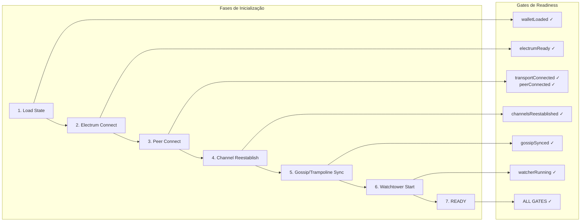

# Lightning Implementation Checklist — iHodl

**Data:** 21 de dezembro de 2025  
**Status:** Consolidação de `lightning-callgraphs.md`, `lightning-worker-consolidation-plan.md` e `ihodl-gap-implementation.md`  
**Objetivo:** Documento único com grafo de inicialização correto e checklist prático de implementação

---

## 1. Grafo de Inicialização Correto

### 1.1 Fluxo de Boot Completo (do App até Lightning Ready)

```mermaid
flowchart TB
  subgraph "Camada de App (src/app)"
    APP_START[App Start] --> ROOT_LAYOUT[_layout.tsx]
    ROOT_LAYOUT --> APP_PROVIDER[AppProvider]
  end

  subgraph "Camada de Provider (src/ui/features/app-provider)"
    APP_PROVIDER --> WALLET_CHECK{Wallet Ativa?}
    WALLET_CHECK -->|Não| WAIT_WALLET[Aguarda seleção de wallet]
    WALLET_CHECK -->|Sim| SYNC_WORKER[syncWorkerWithWallet]
    WAIT_WALLET --> WALLET_CHECK
    SYNC_WORKER --> MUTEX_CHECK{isSyncingWorkerRef?}
    MUTEX_CHECK -->|Sim| SKIP[Skip - já sincronizando]
    MUTEX_CHECK -->|Não| LIGHTNING_INIT[lightningStore.actions.initialize]
  end

  subgraph "Camada de Store (src/ui/features/lightning/store.ts)"
    LIGHTNING_INIT --> GET_WORKER[getWorker - singleton]
    GET_WORKER --> WORKER_INIT[workerService.initialize]
  end

  subgraph "Camada de Serviço (src/core/services/ln-worker-service.ts)"
    WORKER_INIT --> PHASE_1[Fase 1: Load Persisted State]
    PHASE_1 --> PHASE_2[Fase 2: Init Core Components]

    subgraph "Fase 2: Core Components"
      PHASE_2 --> ELECTRUM[connectElectrumWithRetry]
      ELECTRUM --> ELECTRUM_WATCHER[ensureElectrumWatcherStarted]
      ELECTRUM_WATCHER --> CHANNEL_MONITOR[ensureChannelOnChainMonitorStarted]
      CHANNEL_MONITOR --> ERROR_RECOVERY[errorRecoveryService.start]
      ERROR_RECOVERY --> PEER_SERVICE[PeerConnectivityService init]
      PEER_SERVICE --> ROUTING_SERVICE[routingService init]
      ROUTING_SERVICE --> CHANNEL_REESTABLISH[ChannelReestablishService init]
      CHANNEL_REESTABLISH --> WALLET_SERVICE[WalletService init]
      WALLET_SERVICE --> LN_MONITOR[LightningMonitorService.start]
      LN_MONITOR --> WATCHTOWER[WatchtowerService.initialize]
      WATCHTOWER --> WORKER_INSTANCE[LightningWorker creation]
    end

    WORKER_INSTANCE --> PHASE_3[Fase 3: Establish Peer Connections]
    PHASE_3 --> PHASE_4[Fase 4: Reestablish Channels]
    PHASE_4 --> PHASE_5[Fase 5: Sync Gossip ou Trampoline]
    PHASE_5 --> PHASE_6[Fase 6: Start Monitoring]
    PHASE_6 --> READY[Worker READY]
  end

  subgraph "Readiness State"
    READY --> EMIT_READY[emit 'readiness-changed']
    EMIT_READY --> STORE_UPDATE[Store atualiza readinessState]
    STORE_UPDATE --> UI_READY[UI libera operações]
  end
```



### 1.2 Ordem de Fases com Gates (Sequência Obrigatória)



### 1.3 Fluxo de Pagamento (Send Payment)

```mermaid
flowchart LR
  subgraph "UI Layer"
    UI[paymentSend.tsx] --> CHECK_READY{canSendPayment?}
    CHECK_READY -->|Não| BLOCK[Bloqueia UI]
    CHECK_READY -->|Sim| CALL_ACTION[lightningActions.sendPayment]
  end

  subgraph "Store Layer"
    CALL_ACTION --> STORE_SEND[store.sendPayment]
    STORE_SEND --> WORKER_SEND[workerService.sendPayment]
  end

  subgraph "Service Layer"
    WORKER_SEND --> DECODE[decodeInvoice]
    DECODE --> FIND_ROUTE[findRoute / findPaymentRoute]
    FIND_ROUTE --> SEND_HTLC[sendHTLC]
    SEND_HTLC --> SEND_TO_PEER[sendHTLCToPeer]
    SEND_TO_PEER --> PEER_CONN[peerManager.getPeerConnection]
    PEER_CONN --> CHANNEL_MGR[channelManager.addHtlc]
    CHANNEL_MGR --> ENCRYPT[encryptMessage]
    ENCRYPT --> SEND_RAW[sendRawMessage / socket.write]
  end

  subgraph "Network Layer"
    SEND_RAW --> NOISE[Noise XK Transport]
    NOISE --> PEER[Remote Peer]
  end
```



---

## 2. Checklist de Implementação

### Legenda de Status

- ✅ Implementado
- 🔄 Parcialmente implementado
- ❌ Não implementado
- 🔴 Crítico (blocker)
- 🟡 Importante
- 🟢 Nice-to-have

---

### 2.1 Orquestração e Singleton do Worker

| #     | Tarefa                                       | Arquivo(s)                                            | Status | Descrição                                 |
| ----- | -------------------------------------------- | ----------------------------------------------------- | ------ | ----------------------------------------- |
| 2.1.1 | Singleton único via lightningStore           | `src/ui/features/lightning/store.ts`                  | ✅     | `createWorkerService()` chamado uma vez   |
| 2.1.2 | useWorkerService retorna singleton           | `src/ui/features/lightning/hooks/useWorkerService.ts` | ✅     | Hook retorna `lightningStore.getWorker()` |
| 2.1.3 | Remover inicializações duplicadas            | `src/ui/hooks/use-lightning-worker.ts`                | ✅     | Auto-init removido                        |
| 2.1.4 | Mutex de inicialização no WorkerService      | `src/core/services/ln-worker-service.ts`              | ✅     | `initializationPromise` implementado      |
| 2.1.5 | Deprecar `networkStore.getLightningWorker()` | `src/ui/features/network/store.ts`                    | ✅     | Marcado como deprecated                   |

---

### 2.2 Fluxo de Inicialização no AppProvider

| #     | Tarefa                                                 | Arquivo(s)                                              | Status | Descrição                           |
| ----- | ------------------------------------------------------ | ------------------------------------------------------- | ------ | ----------------------------------- |
| 2.2.1 | useEffect para sincronizar worker com wallet           | `src/ui/features/app-provider/AppProvider.tsx` L139-167 | ✅     | `syncWorkerWithWallet` implementado |
| 2.2.2 | Mutex `isSyncingWorkerRef` para evitar race            | `src/ui/features/app-provider/AppProvider.tsx` L141     | ✅     | Ref de controle implementada        |
| 2.2.3 | Chamar `worker.stop()` na troca de wallet              | `src/ui/features/app-provider/AppProvider.tsx` L153-154 | ✅     | Stop chamado antes de nova init     |
| 2.2.4 | Chamar `lightningStore.actions.resetForWalletChange()` | `src/ui/features/app-provider/AppProvider.tsx` L155     | ✅     | Reset de estado implementado        |
| 2.2.5 | Handler para AppState background/foreground            | `src/ui/features/app-provider/AppProvider.tsx` L204-248 | ✅     | Graceful shutdown no background     |

---

### 2.3 Graceful Shutdown com Espera de HTLCs

| #     | Tarefa                                       | Arquivo(s)                                              | Status | Descrição                              |
| ----- | -------------------------------------------- | ------------------------------------------------------- | ------ | -------------------------------------- |
| 2.3.1 | Implementar `waitForPendingHtlcs()`          | `src/core/services/ln-worker-service.ts`                | ✅     | Polling de 500ms com timeout           |
| 2.3.2 | `stop()` chama `waitForPendingHtlcs()`       | `src/core/services/ln-worker-service.ts`                | ✅     | Espera antes de parar                  |
| 2.3.3 | Emitir evento `warning` para HTLCs pendentes | `src/core/services/ln-worker-service.ts`                | ✅     | Evento `unresolved_htlcs`              |
| 2.3.4 | 🔴 UI exibir alerta de HTLCs pendentes       | `src/ui/features/app-provider/AppProvider.tsx` L208-220 | 🔄     | Apenas console.warn, falta Alert/Toast |
| 2.3.5 | 🟡 Permitir forçar fechamento com aviso      | `src/ui/features/lightning/components/`                 | ❌     | Componente de confirmação não existe   |

**Ação 2.3.4:**

```tsx
// Arquivo: src/ui/features/app-provider/AppProvider.tsx
// Linha: ~219
// Adicionar:
import { Alert } from 'react-native'

// No handleWorkerWarning:
if (warning.type === 'unresolved_htlcs' && warning.channels?.length) {
  Alert.alert(
    '⚠️ HTLCs Pendentes',
    `${warning.channels.length} canal(is) têm pagamentos pendentes. Aguarde resolução antes de fechar o app.`,
    [{ text: 'Entendi', style: 'default' }],
  )
}
```

---

### 2.4 Gates de Readiness Obrigatórios

| #     | Tarefa                                     | Arquivo(s)                                                 | Status | Descrição                           |
| ----- | ------------------------------------------ | ---------------------------------------------------------- | ------ | ----------------------------------- |
| 2.4.1 | Modelo `ReadinessState` e `ReadinessLevel` | `src/core/models/lightning/readiness.ts`                   | ✅     | Tipos e helpers definidos           |
| 2.4.2 | WorkerService emite `readiness-changed`    | `src/core/services/ln-worker-service.ts`                   | ✅     | `setReadiness()` emite evento       |
| 2.4.3 | Store escuta e propaga readiness           | `src/ui/features/lightning/store.ts`                       | ✅     | Listener em `attachWorkerListeners` |
| 2.4.4 | Hook `useLightningReadiness()`             | `src/ui/features/lightning/hooks/useLightningReadiness.ts` | ✅     | Retorna state + level               |
| 2.4.5 | Hook `useCanPerformOperation()`            | `src/ui/features/lightning/hooks/useLightningReadiness.ts` | ✅     | Verifica permissão por operação     |
| 2.4.6 | 🔴 Bloquear botões send/receive na UI      | `src/app/(tabs)/lightning/paymentSend.tsx`                 | ❌     | Falta implementar guard             |
| 2.4.7 | 🔴 Bloquear botões send/receive na UI      | `src/app/(tabs)/lightning/paymentReceive.tsx`              | ❌     | Falta implementar guard             |
| 2.4.8 | Componente `LightningReadinessGuard`       | `src/ui/features/lightning/LightningReadinessGuard.tsx`    | ✅     | Existe, verificar uso               |

**Ação 2.4.6 e 2.4.7:**

```tsx
// Arquivo: src/app/(tabs)/lightning/paymentSend.tsx
// Adicionar no topo:
import { useCanPerformOperation, useReadinessBlockers } from '@/ui/features/lightning/hooks'

// No componente:
const canSend = useCanPerformOperation('send')
const blockers = useReadinessBlockers()

// No botão de enviar:
<Button
  disabled={!canSend}
  onPress={handleSend}
>
  {canSend ? 'Enviar Pagamento' : `Aguarde: ${blockers[0]}`}
</Button>
```

---

### 2.5 Conexão Electrum

| #     | Tarefa                                   | Arquivo(s)                                        | Status | Descrição                         |
| ----- | ---------------------------------------- | ------------------------------------------------- | ------ | --------------------------------- |
| 2.5.1 | `connectElectrumWithRetry()` com backoff | `src/core/services/ln-worker-service.ts` L556-572 | ✅     | 3 retries com backoff exponencial |
| 2.5.2 | `ensureElectrumWatcherStarted()`         | `src/core/services/ln-worker-service.ts` L574-589 | ✅     | Watcher idempotente               |
| 2.5.3 | `ensureChannelOnChainMonitorStarted()`   | `src/core/services/ln-worker-service.ts` L591-620 | ✅     | Monitor de canais on-chain        |
| 2.5.4 | Setar `electrumReady` após conexão       | `src/core/services/ln-worker-service.ts` L461-462 | ✅     | Gate setado                       |
| 2.5.5 | Métricas de altura de bloco              | `src/core/services/ln-worker-service.ts` L463     | ✅     | `electrumHeight` em metrics       |

---

### 2.6 Conexão de Peers (BOLT #8 Noise + BOLT #1 Init)

| #     | Tarefa                                       | Arquivo(s)                                        | Status | Descrição                                      |
| ----- | -------------------------------------------- | ------------------------------------------------- | ------ | ---------------------------------------------- |
| 2.6.1 | `PeerConnectivityService` inicializado       | `src/core/services/ln-worker-service.ts` L486-488 | ✅     | Criado se não existe                           |
| 2.6.2 | ✅ Noise handshake com timeout e logs        | `src/core/lib/lightning/peer.ts`                  | ✅     | Timeout 10s, logs detalhados, BOLT #8 completa |
| 2.6.3 | ✅ TCP puro (não TLS) para Lightning         | `src/core/lib/lightning/peer.ts`                  | ✅     | `createLightningSocket` usa TCP puro           |
| 2.6.4 | ✅ Exchange de Init messages (BOLT #1)       | `src/core/lib/lightning/peer.ts`                  | ✅     | Sequence correta com timeout e logs            |
| 2.6.5 | Setar `transportConnected` e `peerConnected` | `src/core/services/ln-worker-service.ts` L304-305 | ✅     | Gates setados                                  |
| 2.6.6 | 🟡 Persistir peers com score/LRU             | `src/core/repositories/lightning.ts`              | ❌     | Não implementado                               |
| 2.6.7 | 🟡 Backoff exponencial para reconexão        | `src/core/services/ln-peer-service.ts`            | 🔄     | Implementação parcial                          |

**✅ RESOLVIDO - Problema identificado e corrigido (21/12/2025):**

**Problema:** Função `receiveRaw` não tinha timeout, causando bloqueio infinito quando peer não respondia ao Act Two. Além disso, TCP buffer discarding message body quando length prefix e body chegavam no mesmo pacote.

**Solução implementada:**

- ✅ Adicionado timeout configurável (padrão 10s) em `receiveRaw`
- ✅ Timeout propagado para handshake e Init exchange
- ✅ Logs detalhados em cada etapa do handshake
- ✅ Verificado uso correto de TCP puro (não TLS)
- ✅ Implementado buffered receive approach com WeakMap para preservar excess bytes
- ✅ Atualizado `receiveRaw` em PeerManager e LightningWorker para usar buffering

**Resultado:** Handshake BOLT #8 e Init BOLT #1 agora funcionam corretamente, com conexões peer estabelecidas com sucesso. Todos os testes de transporte passam (14/14).

---

### 2.7 Reestabelecimento de Canais

| #     | Tarefa                                        | Arquivo(s)                                        | Status | Descrição                                   |
| ----- | --------------------------------------------- | ------------------------------------------------- | ------ | ------------------------------------------- |
| 2.7.1 | `ChannelReestablishService` inicializado      | `src/core/services/ln-worker-service.ts` L492     | ✅     | Service criado                              |
| 2.7.2 | Iterar sobre canais persistidos               | `src/core/services/ln-worker-service.ts` L320-341 | ✅     | Loop com offload chunks                     |
| 2.7.3 | Chamar `reestablishChannel()` para cada canal | `src/core/services/ln-worker-service.ts` L331-335 | ✅     | Chamada individual                          |
| 2.7.4 | Setar `channelsReestablished`                 | `src/core/services/ln-worker-service.ts` L348-349 | ✅     | Gate setado quando todos ok                 |
| 2.7.5 | 🔴 Validar channelId format (hex vs bytes)    | `src/core/services/ln-worker-service.ts` L332     | 🔄     | Try/catch existe, mas conversão pode falhar |

**Ação 2.7.5:**

```typescript
// Arquivo: src/core/services/ln-worker-service.ts
// Linha ~332
// Verificar que hexToUint8Array valida o input:
const channelIdBytes = hexToUint8Array(channel.channelId!)
// Se channelId não for hex válido (length ímpar, chars inválidos), deve skipar
```

---

### 2.8 Gossip Sync e Routing

| #     | Tarefa                                       | Arquivo(s)                                        | Status | Descrição                  |
| ----- | -------------------------------------------- | ------------------------------------------------- | ------ | -------------------------- |
| 2.8.1 | `GossipSyncManager` inicializado             | `src/core/services/ln-worker-service.ts` L703     | ✅     | Manager criado             |
| 2.8.2 | Sync com retries                             | `src/core/services/ln-worker-service.ts` L693-723 | ✅     | 3 retries com backoff      |
| 2.8.3 | Setar `gossipSynced`                         | `src/core/services/ln-worker-service.ts` L363     | ✅     | Gate setado                |
| 2.8.4 | Routing mode para LOCAL quando sync completo | `src/core/services/ln-worker-service.ts` L367-368 | ✅     | `RoutingMode.LOCAL` setado |
| 2.8.5 | Fallback para TRAMPOLINE se sync falhar      | `src/core/services/ln-worker-service.ts` L484-485 | ✅     | Modo trampoline na init    |
| 2.8.6 | 🟡 Cache em disco (`GraphCacheManager`)      | `src/core/lib/lightning/graph-cache.ts`           | 🔄     | Existe mas verificar uso   |
| 2.8.7 | 🟡 UI exibir progresso de gossip             | `src/ui/features/lightning/`                      | ❌     | Não implementado           |

**Ação 2.8.7:**

```tsx
// Criar: src/ui/features/lightning/components/GossipProgress.tsx
// Usar: useLightningState().workerMetrics?.gossipCompleted
// Mostrar: "Sincronizando grafo Lightning... X%" ou "Grafo sincronizado ✓"
```

---

### 2.9 Watchtower

| #     | Tarefa                             | Arquivo(s)                                        | Status | Descrição                    |
| ----- | ---------------------------------- | ------------------------------------------------- | ------ | ---------------------------- |
| 2.9.1 | `WatchtowerService.initialize()`   | `src/core/services/ln-worker-service.ts` L499-501 | ✅     | Inicializado se enabled      |
| 2.9.2 | Setar `watcherRunning`             | `src/core/services/ln-worker-service.ts` L502     | ✅     | Gate setado                  |
| 2.9.3 | 🟡 UI exibir status watchtower     | `src/ui/features/lightning/watchtower/`           | 🔄     | Componentes existem          |
| 2.9.4 | 🟢 Config flag para enable/disable | `src/core/services/ln-worker-service.ts` L224     | ✅     | `enableWatchtower` em config |

---

### 2.10 UI Lightning — Telas Críticas

| #      | Tarefa                                            | Arquivo(s)                                    | Status | Descrição                     |
| ------ | ------------------------------------------------- | --------------------------------------------- | ------ | ----------------------------- |
| 2.10.1 | 🔴 paymentSend.tsx usar readiness guard           | `src/app/(tabs)/lightning/paymentSend.tsx`    | ❌     | Falta implementar             |
| 2.10.2 | 🔴 paymentReceive.tsx usar readiness guard        | `src/app/(tabs)/lightning/paymentReceive.tsx` | ❌     | Falta implementar             |
| 2.10.3 | 🔴 channels.tsx verificar conexão antes de operar | `src/app/(tabs)/lightning/channels.tsx`       | ❌     | Falta implementar             |
| 2.10.4 | 🔴 channelCreate.tsx verificar readiness          | `src/app/(tabs)/lightning/channelCreate.tsx`  | ❌     | Falta implementar             |
| 2.10.5 | index.tsx (dashboard) exibir status correto       | `src/app/(tabs)/lightning/index.tsx`          | ✅     | Usa `LightningDashboard`      |
| 2.10.6 | 🟡 Exibir bloqueadores de readiness               | Todas as telas Lightning                      | ❌     | Usar `useReadinessBlockers()` |

**Ação 2.10.1-2.10.4 (template):**

```tsx
// Em cada tela que requer Lightning operacional:
import { LightningReadinessGuard } from '@/ui/features/lightning'

export default function PaymentSendScreen() {
  return (
    <LightningReadinessGuard requiredLevel="send">{/* Conteúdo da tela */}</LightningReadinessGuard>
  )
}
```

---

### 2.11 Persistência e Recuperação

| #      | Tarefa                         | Arquivo(s)                                        | Status | Descrição                               |
| ------ | ------------------------------ | ------------------------------------------------- | ------ | --------------------------------------- |
| 2.11.1 | `loadPersistedState()` na init | `src/core/services/ln-worker-service.ts` L399-444 | ✅     | Restaura readiness, metrics, sync state |
| 2.11.2 | `saveInitState()` no shutdown  | `src/core/services/ln-worker-service.ts`          | 🔄     | Verificar se chamado no stop()          |
| 2.11.3 | Repository para canais         | `src/core/repositories/lightning.ts`              | ✅     | `findAllChannels()` existe              |
| 2.11.4 | 🟡 Repository para peers       | `src/core/repositories/lightning.ts`              | ❌     | Peers não persistidos                   |
| 2.11.5 | 🟡 Repository para invoices    | `src/core/repositories/lightning.ts`              | 🔄     | Verificar implementação                 |

---

### 2.12 Tratamento de Erros e Logs

| #      | Tarefa                              | Arquivo(s)                                          | Status | Descrição                               |
| ------ | ----------------------------------- | --------------------------------------------------- | ------ | --------------------------------------- |
| 2.12.1 | Logs estruturados por fase          | `src/core/services/ln-worker-service.ts`            | 🔄     | console.log existe, mas não estruturado |
| 2.12.2 | `ErrorRecoveryService` inicializado | `src/core/services/ln-worker-service.ts` L472-473   | ✅     | Service criado e started                |
| 2.12.3 | Emit de eventos de erro             | `src/core/services/ln-worker-service.ts` L567, L713 | ✅     | `emit('error', ...)` implementado       |
| 2.12.4 | 🟡 UI exibir erros de inicialização | `src/ui/features/lightning/LightningInitStatus.tsx` | 🔄     | Componente existe                       |
| 2.12.5 | 🟡 Retry manual de fases com erro   | Todas as telas Lightning                            | ❌     | Não implementado                        |

---

### 2.13 Testes

| #      | Tarefa                                | Arquivo(s)                                        | Status | Descrição                           |
| ------ | ------------------------------------- | ------------------------------------------------- | ------ | ----------------------------------- |
| 2.13.1 | 🔴 Test: inicialização completa       | `src/core/lib/lightning/tests/worker.test.ts`     | 🔄     | Testes existem, verificar cobertura |
| 2.13.2 | 🔴 Test: envio de pagamento com gates | `src/core/lib/lightning/tests/worker.test.ts`     | ❌     | Falta testar com readiness          |
| 2.13.3 | 🔴 Test: Noise handshake              | `src/core/lib/lightning/tests/peer.test.ts`       | 🔄     | Verificar se testa act1/2/3         |
| 2.13.4 | 🟡 Test: reestablish de canais        | `src/core/lib/lightning/tests/`                   | ❌     | Não existe                          |
| 2.13.5 | 🟡 Test: fallback gossip → trampoline | `src/core/lib/lightning/tests/`                   | ❌     | Não existe                          |
| 2.13.6 | 🟡 E2E: payment flow completo         | `src/core/lib/lightning/tests/worker.e2e.test.ts` | 🔄     | Existe, verificar cobertura         |

---

## 3. Priorização de Implementação

### 🔴 Fase 1: Críticos (Bloqueadores de Funcionamento)

1. **2.4.6, 2.4.7**: Adicionar guards de readiness em `paymentSend.tsx` e `paymentReceive.tsx`
2. **2.10.1-2.10.4**: Adicionar `LightningReadinessGuard` em todas as telas de operação
3. **2.13.1-2.13.3**: Testes de inicialização, pagamento com gates, e handshake

### 🟡 Fase 2: Importantes (Estabilidade)

1. **2.3.4**: UI exibir alerta de HTLCs pendentes (Alert/Toast)
2. **2.6.6, 2.6.7**: Persistir peers e melhorar backoff de reconexão
3. **2.8.7**: UI exibir progresso de gossip sync
4. **2.12.4, 2.12.5**: UI exibir erros e permitir retry manual

### 🟢 Fase 3: Melhorias (Nice-to-have)

1. **2.3.5**: Permitir forçar fechamento com aviso
2. **2.11.4**: Persistir peers com score/LRU
3. **2.13.4-2.13.6**: Testes adicionais

---

## 4. Arquivos Chave para Modificação

| Arquivo                                                   | Alterações Necessárias                           |
| --------------------------------------------------------- | ------------------------------------------------ |
| `src/app/(tabs)/lightning/paymentSend.tsx`                | Adicionar guard de readiness                     |
| `src/app/(tabs)/lightning/paymentReceive.tsx`             | Adicionar guard de readiness                     |
| `src/app/(tabs)/lightning/channels.tsx`                   | Adicionar guard de readiness                     |
| `src/app/(tabs)/lightning/channelCreate.tsx`              | Adicionar guard de readiness                     |
| `src/core/lib/lightning/peer.ts`                          | Verificar Noise sobre TCP, sequence de handshake |
| `src/ui/features/app-provider/AppProvider.tsx`            | Alert para HTLCs pendentes                       |
| `src/ui/features/lightning/components/GossipProgress.tsx` | **Criar** componente                             |
| `src/core/lib/lightning/tests/*.test.ts`                  | Adicionar testes críticos                        |

---

## 5. Comandos de Verificação

```bash
# Rodar linter
npm run lint

# Rodar testes
npm test

# Rodar testes específicos de Lightning
npm test -- --testPathPattern=lightning

# Verificar tipos
npx tsc --noEmit
```

---

## 6. Referências

- [lightning-callgraphs.md](./lightning-callgraphs.md) — Grafos de chamadas Electrum/Phoenix/iHodl
- [lightning-worker-consolidation-plan.md](./lightning-worker-consolidation-plan.md) — Plano de consolidação do worker
- [ihodl-gap-implementation.md](./ihodl-gap-implementation.md) — Gap analysis completo
- [wallets-comparison.md](./wallets-comparison.md) — Comparativo de funcionalidades
